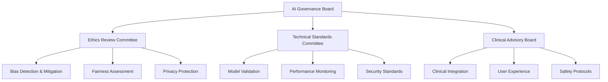

# 🤖 AI Governance & Ethics Framework

This document establishes comprehensive governance, ethics, and responsible AI practices for the Chest X-Ray Pneumonia Detector project, ensuring ethical, fair, and transparent AI deployment in healthcare.

## 🎯 AI Governance Principles

### Core Ethical Principles
1. **Beneficence**: AI systems should benefit patients and healthcare providers
2. **Non-maleficence**: "Do no harm" - minimize risks and adverse outcomes
3. **Autonomy**: Preserve human decision-making authority in medical diagnosis
4. **Justice**: Ensure fair and equitable access to AI benefits
5. **Transparency**: Maintain explainable and interpretable AI decisions
6. **Accountability**: Clear responsibility chains for AI-driven decisions

### Responsible AI Framework


## 🔍 Bias Detection and Mitigation

### Bias Assessment Framework
```python
# bias_assessment.py
class BiasAssessment:
    def __init__(self, model, test_data):
        self.model = model
        self.test_data = test_data
        self.protected_attributes = ['age', 'gender', 'ethnicity', 'hospital']
    
    def assess_demographic_parity(self):
        """Measure prediction parity across demographic groups"""
        results = {}
        
        for attribute in self.protected_attributes:
            groups = self.test_data.groupby(attribute)
            
            for group_name, group_data in groups:
                predictions = self.model.predict(group_data)
                positive_rate = predictions.mean()
                
                results[f"{attribute}_{group_name}"] = {
                    'positive_prediction_rate': positive_rate,
                    'sample_size': len(group_data)
                }
        
        return self.calculate_parity_metrics(results)
    
    def assess_equalized_odds(self):
        """Measure true positive and false positive rate parity"""
        metrics = {}
        
        for attribute in self.protected_attributes:
            groups = self.test_data.groupby(attribute)
            
            for group_name, group_data in groups:
                y_true = group_data['label']
                y_pred = self.model.predict(group_data)
                
                metrics[f"{attribute}_{group_name}"] = {
                    'tpr': self.calculate_tpr(y_true, y_pred),
                    'fpr': self.calculate_fpr(y_true, y_pred),
                    'tnr': self.calculate_tnr(y_true, y_pred),
                    'fnr': self.calculate_fnr(y_true, y_pred)
                }
        
        return metrics
```

### Bias Mitigation Strategies
```python
# bias_mitigation.py
class BiasMitigation:
    def __init__(self, training_data):
        self.training_data = training_data
    
    def reweight_samples(self, protected_attribute):
        """Reweight training samples to achieve demographic balance"""
        from sklearn.utils.class_weight import compute_sample_weight
        
        # Calculate weights to balance protected groups
        weights = compute_sample_weight(
            class_weight='balanced',
            y=self.training_data[protected_attribute]
        )
        
        return weights
    
    def adversarial_debiasing(self, model, protected_attributes):
        """Implement adversarial training to reduce bias"""
        class AdversarialDebiasingModel(tf.keras.Model):
            def __init__(self, base_model):
                super().__init__()
                self.base_model = base_model
                self.adversarial_classifier = tf.keras.Sequential([
                    tf.keras.layers.Dense(50, activation='relu'),
                    tf.keras.layers.Dense(len(protected_attributes), activation='softmax')
                ])
            
            def call(self, inputs):
                predictions = self.base_model(inputs)
                adversarial_predictions = self.adversarial_classifier(predictions)
                return predictions, adversarial_predictions
        
        return AdversarialDebiasingModel(model)
```

## ⚖️ Fairness Metrics and Monitoring

### Comprehensive Fairness Evaluation
```python
# fairness_metrics.py
class FairnessMetrics:
    def __init__(self, y_true, y_pred, sensitive_attributes):
        self.y_true = y_true
        self.y_pred = y_pred
        self.sensitive_attributes = sensitive_attributes
    
    def demographic_parity_difference(self, attribute):
        """Calculate demographic parity difference"""
        groups = self.sensitive_attributes[attribute].unique()
        rates = []
        
        for group in groups:
            mask = self.sensitive_attributes[attribute] == group
            positive_rate = self.y_pred[mask].mean()
            rates.append(positive_rate)
        
        return max(rates) - min(rates)
    
    def equalized_odds_difference(self, attribute):
        """Calculate equalized odds difference"""
        groups = self.sensitive_attributes[attribute].unique()
        tpr_diff = []
        fpr_diff = []
        
        for group in groups:
            mask = self.sensitive_attributes[attribute] == group
            y_true_group = self.y_true[mask]
            y_pred_group = self.y_pred[mask]
            
            tpr = self.true_positive_rate(y_true_group, y_pred_group)
            fpr = self.false_positive_rate(y_true_group, y_pred_group)
            
            tpr_diff.append(tpr)
            fpr_diff.append(fpr)
        
        return {
            'tpr_difference': max(tpr_diff) - min(tpr_diff),
            'fpr_difference': max(fpr_diff) - min(fpr_diff)
        }
    
    def generate_fairness_report(self):
        """Generate comprehensive fairness assessment report"""
        report = {
            'timestamp': datetime.utcnow().isoformat(),
            'metrics': {}
        }
        
        for attribute in self.sensitive_attributes.columns:
            report['metrics'][attribute] = {
                'demographic_parity': self.demographic_parity_difference(attribute),
                'equalized_odds': self.equalized_odds_difference(attribute),
                'statistical_parity': self.statistical_parity_difference(attribute)
            }
        
        return report
```

### Continuous Fairness Monitoring
```python
# fairness_monitor.py
class FairnessMonitor:
    def __init__(self, model, fairness_thresholds):
        self.model = model
        self.fairness_thresholds = fairness_thresholds
        self.alert_system = AlertSystem()
    
    async def monitor_fairness(self, prediction_data):
        """Continuous monitoring of model fairness"""
        fairness_metrics = FairnessMetrics(
            prediction_data['true_labels'],
            prediction_data['predictions'],
            prediction_data['sensitive_attributes']
        )
        
        report = fairness_metrics.generate_fairness_report()
        
        # Check for fairness violations
        violations = self.detect_fairness_violations(report)
        
        if violations:
            await self.handle_fairness_violations(violations)
        
        # Log fairness metrics
        self.log_fairness_metrics(report)
        
        return report
    
    def detect_fairness_violations(self, report):
        """Detect when fairness metrics exceed thresholds"""
        violations = []
        
        for attribute, metrics in report['metrics'].items():
            for metric_name, value in metrics.items():
                threshold = self.fairness_thresholds.get(metric_name, 0.1)
                
                if abs(value) > threshold:
                    violations.append({
                        'attribute': attribute,
                        'metric': metric_name,
                        'value': value,
                        'threshold': threshold
                    })
        
        return violations
```

## 🛡️ Privacy and Data Protection

### Privacy-Preserving Techniques
```python
# privacy_protection.py
class PrivacyProtection:
    def __init__(self, privacy_budget=1.0):
        self.privacy_budget = privacy_budget
    
    def differential_privacy_training(self, model, train_data, epsilon=0.1):
        """Implement differential privacy in model training"""
        from tensorflow_privacy.privacy.optimizers import dp_optimizer_keras
        
        dp_optimizer = dp_optimizer_keras.DPKerasAdamOptimizer(
            l2_norm_clip=1.0,
            noise_multiplier=1.1,
            num_microbatches=250,
            learning_rate=0.001
        )
        
        model.compile(
            optimizer=dp_optimizer,
            loss='binary_crossentropy',
            metrics=['accuracy']
        )
        
        return model
    
    def federated_learning_setup(self, client_data):
        """Setup federated learning for distributed privacy-preserving training"""
        import tensorflow_federated as tff
        
        def model_fn():
            keras_model = self.create_keras_model()
            return tff.learning.from_keras_model(
                keras_model,
                input_spec=client_data.element_spec,
                loss=tf.keras.losses.BinaryCrossentropy(),
                metrics=[tf.keras.metrics.BinaryAccuracy()]
            )
        
        return tff.learning.build_federated_averaging_process(
            model_fn,
            client_optimizer_fn=lambda: tf.keras.optimizers.SGD(learning_rate=0.02),
            server_optimizer_fn=lambda: tf.keras.optimizers.SGD(learning_rate=1.0)
        )
    
    def anonymize_patient_data(self, data):
        """Anonymize patient data using k-anonymity"""
        from pycanon import anonymity, report
        
        # Define quasi-identifiers and sensitive attributes
        quasi_identifiers = ['age', 'gender', 'hospital_location']
        sensitive_attributes = ['diagnosis', 'medical_history']
        
        # Apply k-anonymity
        k_anonymous_data = anonymity.k_anonymity(
            data,
            quasi_identifiers,
            k=5  # Minimum group size
        )
        
        return k_anonymous_data
```

### HIPAA Compliance Framework
```python
# hipaa_compliance.py
class HIPAACompliance:
    def __init__(self):
        self.phi_fields = [
            'patient_name', 'patient_id', 'ssn', 'medical_record_number',
            'account_number', 'certificate_number', 'device_identifier',
            'biometric_identifier', 'photo', 'email', 'phone'
        ]
    
    def detect_phi_in_data(self, data):
        """Detect Protected Health Information in datasets"""
        phi_detected = {}
        
        for field in self.phi_fields:
            if field in data.columns:
                phi_detected[field] = {
                    'present': True,
                    'sample_count': len(data[field].dropna()),
                    'risk_level': self.assess_phi_risk(field)
                }
        
        return phi_detected
    
    def encrypt_phi_data(self, data, encryption_key):
        """Encrypt PHI data using AES encryption"""
        from cryptography.fernet import Fernet
        
        cipher_suite = Fernet(encryption_key)
        
        for field in self.phi_fields:
            if field in data.columns:
                data[field] = data[field].apply(
                    lambda x: cipher_suite.encrypt(str(x).encode()) if pd.notna(x) else x
                )
        
        return data
    
    def generate_compliance_report(self, data_processing_log):
        """Generate HIPAA compliance audit report"""
        return {
            'audit_date': datetime.utcnow().isoformat(),
            'data_access_log': data_processing_log,
            'phi_handling': self.audit_phi_handling(),
            'encryption_status': self.verify_encryption_status(),
            'access_controls': self.audit_access_controls(),
            'compliance_score': self.calculate_compliance_score()
        }
```

## 🔍 Model Explainability and Interpretability

### Explainable AI Implementation
```python
# explainable_ai.py
class ExplainableAI:
    def __init__(self, model):
        self.model = model
        self.explainers = self.initialize_explainers()
    
    def initialize_explainers(self):
        """Initialize multiple explanation methods"""
        return {
            'lime': self.setup_lime_explainer(),
            'shap': self.setup_shap_explainer(),
            'grad_cam': self.setup_gradcam_explainer(),
            'integrated_gradients': self.setup_integrated_gradients()
        }
    
    def explain_prediction(self, image, method='all'):
        """Generate explanations for a single prediction"""
        explanations = {}
        
        if method == 'all' or method == 'lime':
            explanations['lime'] = self.lime_explanation(image)
        
        if method == 'all' or method == 'shap':
            explanations['shap'] = self.shap_explanation(image)
        
        if method == 'all' or method == 'grad_cam':
            explanations['grad_cam'] = self.gradcam_explanation(image)
        
        if method == 'all' or method == 'integrated_gradients':
            explanations['integrated_gradients'] = self.integrated_gradients_explanation(image)
        
        return explanations
    
    def generate_explanation_report(self, image, prediction):
        """Generate comprehensive explanation report"""
        explanations = self.explain_prediction(image)
        
        report = {
            'timestamp': datetime.utcnow().isoformat(),
            'prediction': {
                'class': prediction['class'],
                'confidence': prediction['confidence'],
                'probability_distribution': prediction['probabilities']
            },
            'explanations': explanations,
            'consistency_score': self.calculate_explanation_consistency(explanations),
            'reliability_metrics': self.assess_explanation_reliability(explanations)
        }
        
        return report
```

### Clinical Decision Support Integration
```python
# clinical_decision_support.py
class ClinicalDecisionSupport:
    def __init__(self, model, explainer):
        self.model = model
        self.explainer = explainer
        self.clinical_guidelines = self.load_clinical_guidelines()
    
    def generate_clinical_recommendation(self, image, patient_context):
        """Generate AI-assisted clinical recommendation"""
        # Get model prediction
        prediction = self.model.predict(image)
        
        # Generate explanation
        explanation = self.explainer.explain_prediction(image)
        
        # Apply clinical context
        clinical_factors = self.assess_clinical_factors(patient_context)
        
        # Generate recommendation
        recommendation = {
            'ai_prediction': {
                'diagnosis': prediction['class'],
                'confidence': prediction['confidence'],
                'explanation': explanation
            },
            'clinical_context': clinical_factors,
            'recommendation': self.synthesize_recommendation(
                prediction, clinical_factors
            ),
            'confidence_level': self.calculate_overall_confidence(
                prediction, clinical_factors
            ),
            'suggested_actions': self.suggest_clinical_actions(
                prediction, clinical_factors
            )
        }
        
        return recommendation
    
    def validate_against_guidelines(self, recommendation):
        """Validate recommendation against clinical guidelines"""
        guideline_checks = []
        
        for guideline in self.clinical_guidelines:
            check_result = guideline.validate(recommendation)
            guideline_checks.append({
                'guideline': guideline.name,
                'compliant': check_result.is_compliant,
                'violations': check_result.violations,
                'suggestions': check_result.suggestions
            })
        
        return guideline_checks
```

## 📊 AI Risk Assessment and Management

### Risk Assessment Framework
```python
# ai_risk_assessment.py
class AIRiskAssessment:
    def __init__(self):
        self.risk_categories = {
            'technical': ['model_drift', 'data_quality', 'system_failure'],
            'ethical': ['bias', 'fairness', 'transparency'],
            'regulatory': ['compliance', 'audit_trail', 'data_protection'],
            'clinical': ['misdiagnosis', 'overreliance', 'workflow_disruption']
        }
    
    def assess_model_risk(self, model_metrics, deployment_context):
        """Comprehensive AI risk assessment"""
        risk_scores = {}
        
        for category, risks in self.risk_categories.items():
            category_score = 0
            
            for risk in risks:
                risk_score = self.calculate_risk_score(
                    risk, model_metrics, deployment_context
                )
                category_score += risk_score
            
            risk_scores[category] = {
                'score': category_score / len(risks),
                'level': self.categorize_risk_level(category_score / len(risks)),
                'mitigation_required': category_score / len(risks) > 0.7
            }
        
        return risk_scores
    
    def generate_risk_mitigation_plan(self, risk_assessment):
        """Generate specific mitigation strategies"""
        mitigation_plan = {}
        
        for category, assessment in risk_assessment.items():
            if assessment['mitigation_required']:
                mitigation_plan[category] = {
                    'immediate_actions': self.get_immediate_mitigations(category),
                    'long_term_strategies': self.get_long_term_mitigations(category),
                    'monitoring_requirements': self.get_monitoring_requirements(category),
                    'timeline': self.estimate_mitigation_timeline(category)
                }
        
        return mitigation_plan
```

### Continuous Risk Monitoring
```python
# risk_monitor.py
class RiskMonitor:
    def __init__(self, risk_thresholds):
        self.risk_thresholds = risk_thresholds
        self.alert_system = AlertSystem()
    
    async def monitor_ai_risks(self):
        """Continuous monitoring of AI-related risks"""
        while True:
            # Collect current metrics
            current_metrics = await self.collect_system_metrics()
            
            # Assess risks
            risk_assessment = AIRiskAssessment().assess_model_risk(
                current_metrics, self.get_deployment_context()
            )
            
            # Check for high-risk conditions
            high_risks = self.identify_high_risks(risk_assessment)
            
            if high_risks:
                await self.handle_high_risk_conditions(high_risks)
            
            # Log risk metrics
            self.log_risk_metrics(risk_assessment)
            
            await asyncio.sleep(300)  # Check every 5 minutes
    
    def handle_high_risk_conditions(self, high_risks):
        """Automated response to high-risk conditions"""
        for risk in high_risks:
            if risk['category'] == 'technical' and risk['score'] > 0.9:
                # Trigger model rollback
                self.trigger_model_rollback()
            elif risk['category'] == 'ethical' and risk['score'] > 0.8:
                # Increase human oversight
                self.increase_human_oversight()
            elif risk['category'] == 'clinical' and risk['score'] > 0.85:
                # Alert medical staff
                self.alert_medical_staff(risk)
```

## 📋 AI Governance Documentation

### Model Cards Implementation
```python
# model_cards.py
class ModelCard:
    def __init__(self, model_info):
        self.model_info = model_info
    
    def generate_model_card(self):
        """Generate comprehensive model documentation"""
        return {
            'model_details': {
                'name': self.model_info['name'],
                'version': self.model_info['version'],
                'date': self.model_info['creation_date'],
                'type': self.model_info['model_type'],
                'architecture': self.model_info['architecture'],
                'training_data': self.model_info['training_data_description']
            },
            'intended_use': {
                'primary_uses': self.model_info['primary_uses'],
                'primary_users': self.model_info['target_users'],
                'out_of_scope': self.model_info['out_of_scope_uses']
            },
            'factors': {
                'relevant_factors': self.model_info['relevant_factors'],
                'evaluation_data': self.model_info['evaluation_data'],
                'demographic_groups': self.model_info['demographic_groups']
            },
            'metrics': {
                'performance_measures': self.model_info['performance_metrics'],
                'decision_thresholds': self.model_info['decision_thresholds'],
                'fairness_metrics': self.model_info['fairness_assessment']
            },
            'evaluation_data': {
                'datasets': self.model_info['evaluation_datasets'],
                'motivation': self.model_info['evaluation_motivation'],
                'preprocessing': self.model_info['data_preprocessing']
            },
            'training_data': {
                'description': self.model_info['training_data_description'],
                'preprocessing': self.model_info['training_preprocessing'],
                'biases': self.model_info['known_biases']
            },
            'quantitative_analyses': {
                'unitary_results': self.model_info['unitary_results'],
                'intersectional_results': self.model_info['intersectional_results']
            },
            'ethical_considerations': {
                'sensitive_use_cases': self.model_info['sensitive_use_cases'],
                'risks': self.model_info['identified_risks'],
                'mitigation_strategies': self.model_info['mitigation_strategies']
            },
            'recommendations': {
                'deployment_recommendations': self.model_info['deployment_advice'],
                'monitoring_requirements': self.model_info['monitoring_needs'],
                'update_frequency': self.model_info['recommended_updates']
            }
        }
```

### Algorithmic Impact Assessment
```python
# algorithmic_impact_assessment.py
class AlgorithmicImpactAssessment:
    def __init__(self, model, deployment_context):
        self.model = model
        self.deployment_context = deployment_context
    
    def conduct_impact_assessment(self):
        """Comprehensive algorithmic impact assessment"""
        assessment = {
            'overview': self.generate_overview(),
            'stakeholder_analysis': self.analyze_stakeholders(),
            'risk_assessment': self.assess_potential_risks(),
            'fairness_analysis': self.analyze_fairness_implications(),
            'transparency_measures': self.evaluate_transparency(),
            'human_oversight': self.assess_human_oversight(),
            'accountability_framework': self.define_accountability(),
            'mitigation_measures': self.recommend_mitigations(),
            'monitoring_plan': self.create_monitoring_plan(),
            'review_schedule': self.establish_review_schedule()
        }
        
        return assessment
    
    def analyze_stakeholders(self):
        """Identify and analyze all stakeholders"""
        stakeholders = {
            'primary_users': ['radiologists', 'physicians', 'technicians'],
            'secondary_users': ['hospital_administrators', 'patients'],
            'affected_parties': ['patient_families', 'insurance_companies'],
            'oversight_bodies': ['regulatory_agencies', 'ethics_committees']
        }
        
        stakeholder_analysis = {}
        for category, groups in stakeholders.items():
            stakeholder_analysis[category] = []
            for group in groups:
                stakeholder_analysis[category].append({
                    'group': group,
                    'interests': self.identify_interests(group),
                    'concerns': self.identify_concerns(group),
                    'impact_level': self.assess_impact_level(group),
                    'mitigation_needs': self.assess_mitigation_needs(group)
                })
        
        return stakeholder_analysis
```

## 🔄 Continuous Governance and Improvement

### Governance Workflow Automation
```python
# governance_automation.py
class GovernanceAutomation:
    def __init__(self):
        self.governance_workflows = {
            'model_review': self.create_model_review_workflow(),
            'bias_assessment': self.create_bias_assessment_workflow(),
            'risk_evaluation': self.create_risk_evaluation_workflow(),
            'compliance_check': self.create_compliance_workflow()
        }
    
    async def execute_governance_workflow(self, workflow_type, trigger_event):
        """Execute automated governance workflows"""
        workflow = self.governance_workflows[workflow_type]
        
        # Execute workflow steps
        for step in workflow.steps:
            result = await step.execute(trigger_event)
            
            if not result.success:
                await self.handle_workflow_failure(workflow_type, step, result)
                break
            
            # Update workflow state
            workflow.update_state(step.name, result)
        
        # Generate workflow report
        report = workflow.generate_report()
        await self.submit_governance_report(report)
        
        return report
    
    def create_model_review_workflow(self):
        """Define model review workflow"""
        return GovernanceWorkflow([
            WorkflowStep('technical_review', self.conduct_technical_review),
            WorkflowStep('ethical_review', self.conduct_ethical_review),
            WorkflowStep('clinical_review', self.conduct_clinical_review),
            WorkflowStep('approval_decision', self.make_approval_decision)
        ])
```

---

This AI Governance framework ensures responsible development, deployment, and maintenance of AI systems in healthcare, balancing innovation with ethical considerations and regulatory compliance. Regular reviews and updates of these governance practices ensure continued alignment with evolving ethical standards and regulatory requirements.