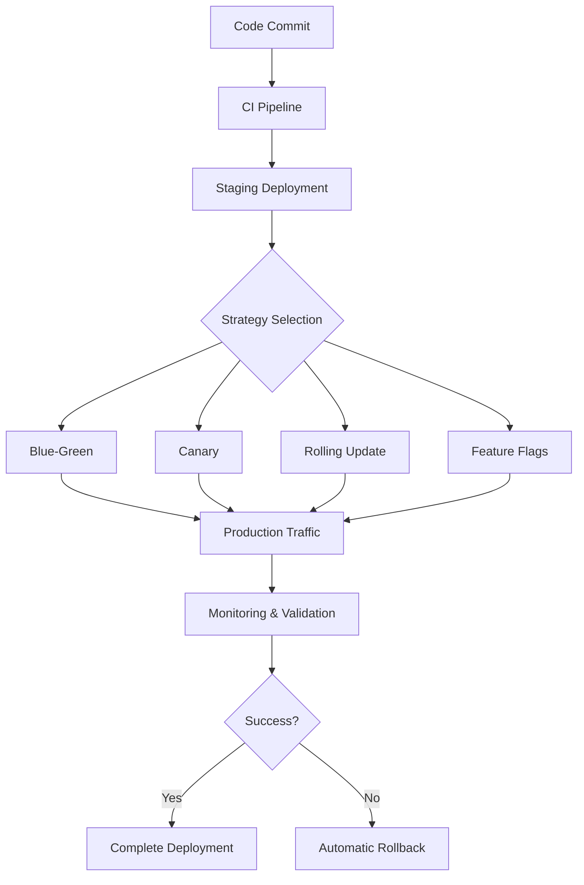

# 🚀 Advanced Deployment Strategies

This document outlines sophisticated deployment strategies for the Chest X-Ray Pneumonia Detector project, designed for zero-downtime deployments and risk mitigation in production environments.

## 🎯 Deployment Strategy Overview



## 🔵🟢 Blue-Green Deployment

### Strategy Overview
Blue-Green deployment maintains two identical production environments (Blue and Green). Traffic switches instantly between environments, enabling zero-downtime deployments and immediate rollback capability.

### Implementation Architecture
```yaml
# blue-green-deployment.yml
apiVersion: argoproj.io/v1alpha1
kind: Rollout
metadata:
  name: pneumonia-detector
spec:
  replicas: 5
  strategy:
    blueGreen:
      activeService: pneumonia-detector-active
      previewService: pneumonia-detector-preview
      autoPromotionEnabled: false
      scaleDownDelaySeconds: 30
      prePromotionAnalysis:
        templates:
        - templateName: success-rate
        args:
        - name: service-name
          value: pneumonia-detector-preview
      postPromotionAnalysis:
        templates:
        - templateName: success-rate
        args:
        - name: service-name
          value: pneumonia-detector-active
```

### Benefits
- **Zero Downtime**: Instant traffic switching
- **Full Environment Testing**: Complete validation before cutover
- **Immediate Rollback**: Switch back to previous version instantly
- **Resource Efficiency**: Full capacity during deployment

### Use Cases
- **Major Releases**: Significant model updates or architectural changes
- **High-Risk Deployments**: New ML models with uncertain performance
- **Compliance Requirements**: Environments requiring extensive validation

### Automated Health Validation
```python
# blue_green_validator.py
class BlueGreenValidator:
    def __init__(self, green_endpoint, blue_endpoint):
        self.green_endpoint = green_endpoint
        self.blue_endpoint = blue_endpoint
    
    async def validate_green_environment(self):
        """Comprehensive health check for green environment"""
        checks = await asyncio.gather(
            self.check_model_accuracy(),
            self.check_response_times(),
            self.check_error_rates(),
            self.check_resource_usage()
        )
        
        return all(checks)
    
    async def cutover_traffic(self):
        """Switch traffic from blue to green"""
        if await self.validate_green_environment():
            await self.update_load_balancer_config()
            await self.monitor_cutover_metrics()
            return True
        return False
```

## 🕯️ Canary Deployment

### Strategy Overview
Canary deployment gradually shifts traffic from the stable version to the new version, allowing real-world validation with minimal risk exposure.

### Traffic Split Configuration
```yaml
# canary-deployment.yml
apiVersion: argoproj.io/v1alpha1
kind: Rollout
metadata:
  name: pneumonia-detector-canary
spec:
  replicas: 10
  strategy:
    canary:
      steps:
      - setWeight: 5    # 5% traffic to canary
      - pause: {duration: 10m}
      - setWeight: 20   # 20% traffic to canary
      - pause: {analysis: {successCondition: "result[0] >= 0.95"}}
      - setWeight: 50   # 50% traffic to canary
      - pause: {duration: 30m}
      - setWeight: 100  # Full traffic to canary
      
      analysis:
        templates:
        - templateName: model-accuracy-check
        - templateName: error-rate-analysis
        - templateName: latency-analysis
```

### Advanced Canary Analysis
```python
# canary_analysis.py
class CanaryAnalyzer:
    def __init__(self, canary_metrics, stable_metrics):
        self.canary_metrics = canary_metrics
        self.stable_metrics = stable_metrics
    
    def analyze_performance(self):
        """Compare canary vs stable performance"""
        results = {
            'accuracy_comparison': self.compare_accuracy(),
            'latency_comparison': self.compare_latency(),
            'error_rate_comparison': self.compare_error_rates(),
            'resource_efficiency': self.compare_resource_usage()
        }
        
        return self.make_deployment_decision(results)
    
    def compare_accuracy(self):
        """Statistical significance test for model accuracy"""
        from scipy import stats
        
        t_stat, p_value = stats.ttest_ind(
            self.canary_metrics.accuracy_scores,
            self.stable_metrics.accuracy_scores
        )
        
        return {
            'significant_improvement': p_value < 0.05 and t_stat > 0,
            'degradation_detected': p_value < 0.05 and t_stat < -2,
            'confidence_level': 1 - p_value
        }
```

### Automated Canary Decision Making
```python
# canary_controller.py
class CanaryController:
    def __init__(self):
        self.rollback_triggers = {
            'error_rate_threshold': 0.05,
            'latency_degradation': 200,  # ms
            'accuracy_drop': 0.02
        }
    
    async def monitor_canary(self):
        """Continuous monitoring during canary deployment"""
        while self.is_canary_active():
            metrics = await self.collect_canary_metrics()
            
            if self.should_rollback(metrics):
                await self.execute_rollback()
                break
            elif self.should_promote(metrics):
                await self.promote_canary()
                break
            
            await asyncio.sleep(30)  # Check every 30 seconds
```

## 🔄 Rolling Updates

### Strategy Overview
Rolling updates gradually replace instances of the old version with the new version, maintaining service availability throughout the deployment process.

### Kubernetes Rolling Update Configuration
```yaml
# rolling-update-deployment.yml
apiVersion: apps/v1
kind: Deployment
metadata:
  name: pneumonia-detector
spec:
  replicas: 6
  strategy:
    type: RollingUpdate
    rollingUpdate:
      maxUnavailable: 1
      maxSurge: 2
  template:
    spec:
      containers:
      - name: detector
        image: pneumonia-detector:latest
        readinessProbe:
          httpGet:
            path: /health/ready
            port: 8080
          initialDelaySeconds: 30
          periodSeconds: 10
        livenessProbe:
          httpGet:
            path: /health/live
            port: 8080
          initialDelaySeconds: 45
          periodSeconds: 15
```

### Intelligent Rolling Update Controller
```python
# rolling_update_controller.py
class RollingUpdateController:
    def __init__(self, deployment_config):
        self.config = deployment_config
        self.health_checker = HealthChecker()
    
    async def execute_rolling_update(self):
        """Execute controlled rolling update with health validation"""
        pods_to_update = await self.get_update_candidates()
        
        for pod in pods_to_update:
            # Update pod
            await self.update_pod(pod)
            
            # Wait for readiness
            await self.wait_for_pod_readiness(pod)
            
            # Validate health
            if not await self.validate_pod_health(pod):
                await self.rollback_pod(pod)
                raise DeploymentException(f"Pod {pod.name} failed health check")
            
            # Brief pause before next update
            await asyncio.sleep(self.config.update_interval)
```

## 🏃‍♂️ Feature Flag-Based Deployment

### Strategy Overview
Feature flags enable runtime control over new functionality, allowing gradual rollout and instant feature toggling without code deployment.

### Feature Flag Configuration
```python
# feature_flags.py
class FeatureFlags:
    def __init__(self):
        self.flags = {
            'new_model_v3': {
                'enabled': False,
                'rollout_percentage': 0,
                'user_segments': [],
                'override_conditions': []
            },
            'enhanced_preprocessing': {
                'enabled': True,
                'rollout_percentage': 25,
                'user_segments': ['beta_users'],
                'override_conditions': ['high_confidence_threshold']
            }
        }
    
    def is_feature_enabled(self, feature_name, user_context=None):
        """Determine if feature is enabled for given context"""
        flag = self.flags.get(feature_name, {})
        
        if not flag.get('enabled', False):
            return False
        
        # Check rollout percentage
        if random.randint(1, 100) <= flag.get('rollout_percentage', 0):
            return True
        
        # Check user segments
        if user_context and self.user_in_segments(user_context, flag.get('user_segments', [])):
            return True
        
        return False
```

### Dynamic Model Selection with Feature Flags
```python
# model_selector.py
class ModelSelector:
    def __init__(self, feature_flags):
        self.feature_flags = feature_flags
        self.models = {
            'stable': ModelV2(),
            'experimental': ModelV3(),
            'fallback': ModelV1()
        }
    
    def select_model(self, request_context):
        """Select appropriate model based on feature flags"""
        if self.feature_flags.is_feature_enabled('new_model_v3', request_context):
            return self.models['experimental']
        elif self.models['stable'].is_healthy():
            return self.models['stable']
        else:
            return self.models['fallback']
```

## 🎯 Multi-Region Deployment

### Strategy Overview
Multi-region deployment ensures global availability and disaster recovery by distributing the application across multiple geographic regions.

### Global Load Balancer Configuration
```yaml
# global-load-balancer.yml
apiVersion: networking.istio.io/v1beta1
kind: Gateway
metadata:
  name: pneumonia-detector-global
spec:
  selector:
    istio: ingressgateway
  servers:
  - port:
      number: 443
      name: https
      protocol: HTTPS
    hosts:
    - detector.example.com
    tls:
      mode: SIMPLE
      credentialName: detector-tls

---
apiVersion: networking.istio.io/v1beta1
kind: VirtualService
metadata:
  name: pneumonia-detector-routing
spec:
  hosts:
  - detector.example.com
  gateways:
  - pneumonia-detector-global
  http:
  - match:
    - headers:
        x-region:
          exact: us-east-1
    route:
    - destination:
        host: detector-us-east-1.local
        port:
          number: 80
      weight: 100
  - match:
    - headers:
        x-region:
          exact: eu-west-1
    route:
    - destination:
        host: detector-eu-west-1.local
        port:
          number: 80
      weight: 100
```

### Cross-Region Synchronization
```python
# region_sync.py
class RegionSyncManager:
    def __init__(self, regions):
        self.regions = regions
        self.sync_interval = 300  # 5 minutes
    
    async def sync_model_artifacts(self):
        """Synchronize ML models across regions"""
        latest_model = await self.get_latest_model_version()
        
        sync_tasks = []
        for region in self.regions:
            if not await self.is_model_current(region, latest_model):
                sync_tasks.append(
                    self.deploy_model_to_region(region, latest_model)
                )
        
        await asyncio.gather(*sync_tasks)
    
    async def handle_region_failover(self, failed_region):
        """Automatic failover to healthy region"""
        healthy_regions = await self.get_healthy_regions()
        
        if not healthy_regions:
            await self.trigger_disaster_recovery()
            return
        
        # Redistribute traffic
        await self.update_global_load_balancer(
            exclude_region=failed_region,
            available_regions=healthy_regions
        )
```

## 🔥 Disaster Recovery and Rollback

### Automated Rollback Triggers
```python
# rollback_manager.py
class RollbackManager:
    def __init__(self):
        self.rollback_triggers = {
            'error_rate_spike': {
                'threshold': 0.1,
                'duration': '2m',
                'action': 'immediate_rollback'
            },
            'accuracy_degradation': {
                'threshold': 0.05,
                'duration': '5m',
                'action': 'staged_rollback'
            },
            'latency_increase': {
                'threshold': 500,  # ms
                'duration': '3m',
                'action': 'canary_rollback'
            }
        }
    
    async def monitor_deployment_health(self):
        """Continuous monitoring with automatic rollback"""
        while True:
            metrics = await self.collect_deployment_metrics()
            
            for trigger_name, config in self.rollback_triggers.items():
                if self.is_trigger_activated(metrics, config):
                    await self.execute_rollback(config['action'])
                    break
            
            await asyncio.sleep(30)
```

### Multi-Level Rollback Strategy
```python
# rollback_strategies.py
class RollbackStrategies:
    async def immediate_rollback(self):
        """Instant rollback for critical issues"""
        await self.switch_to_previous_version()
        await self.notify_incident_team("Critical rollback executed")
    
    async def staged_rollback(self):
        """Gradual rollback for less critical issues"""
        await self.reduce_new_version_traffic(0.5)
        await asyncio.sleep(300)  # 5 minute observation
        
        if await self.is_issue_resolved():
            await self.restore_traffic_distribution()
        else:
            await self.complete_rollback()
    
    async def canary_rollback(self):
        """Rollback canary deployment only"""
        await self.stop_canary_traffic()
        await self.scale_down_canary_instances()
        await self.notify_development_team("Canary rollback completed")
```

## 📊 Deployment Monitoring and Analytics

### Deployment Success Metrics
```python
# deployment_analytics.py
class DeploymentAnalytics:
    def __init__(self):
        self.metrics = {
            'deployment_frequency': Counter('deployments_total'),
            'deployment_duration': Histogram('deployment_duration_seconds'),
            'rollback_rate': Counter('rollbacks_total'),
            'success_rate': Gauge('deployment_success_rate')
        }
    
    def track_deployment(self, deployment_info):
        """Track deployment metrics"""
        self.metrics['deployment_frequency'].inc()
        
        if deployment_info.success:
            self.metrics['deployment_duration'].observe(
                deployment_info.duration
            )
        else:
            self.metrics['rollback_rate'].inc()
        
        self.update_success_rate()
    
    def generate_deployment_report(self):
        """Generate comprehensive deployment analytics"""
        return {
            'total_deployments': self.get_total_deployments(),
            'average_deployment_time': self.get_average_deployment_time(),
            'success_rate': self.get_success_rate(),
            'rollback_frequency': self.get_rollback_frequency(),
            'trends': self.analyze_deployment_trends()
        }
```

### Real-time Deployment Dashboard
```python
# deployment_dashboard.py
class DeploymentDashboard:
    def __init__(self):
        self.websocket_clients = set()
    
    async def broadcast_deployment_status(self, status):
        """Real-time deployment status updates"""
        message = {
            'timestamp': datetime.utcnow().isoformat(),
            'deployment_id': status.deployment_id,
            'stage': status.current_stage,
            'progress': status.progress_percentage,
            'health_metrics': status.health_metrics
        }
        
        await self.broadcast_to_clients(message)
    
    async def handle_deployment_events(self):
        """Process deployment events for dashboard"""
        async for event in self.deployment_event_stream():
            await self.update_deployment_state(event)
            await self.broadcast_deployment_status(event)
```

## 🔧 Infrastructure as Code for Deployments

### Terraform Configuration for Multi-Environment
```hcl
# environments/production/main.tf
module "pneumonia_detector" {
  source = "../../modules/ml-service"
  
  environment = "production"
  
  # Blue-Green Configuration
  blue_green_enabled = true
  blue_instances = 5
  green_instances = 5
  
  # Canary Configuration
  canary_enabled = true
  canary_percentage = 5
  
  # Auto-scaling
  min_replicas = 3
  max_replicas = 20
  target_cpu_utilization = 70
  
  # Health Checks
  health_check_path = "/health/ready"
  health_check_interval = 30
  health_check_timeout = 10
  
  # Monitoring
  prometheus_enabled = true
  grafana_dashboards = true
  alert_rules = true
}
```

### Helm Chart for Complex Deployments
```yaml
# charts/pneumonia-detector/values.yaml
replicaCount: 3

deployment:
  strategy: RollingUpdate
  maxUnavailable: 1
  maxSurge: 1

blueGreen:
  enabled: false
  activeService: pneumonia-detector-active
  previewService: pneumonia-detector-preview

canary:
  enabled: true
  steps:
    - setWeight: 5
    - pause: 600
    - setWeight: 20
    - pause: 1200
    - setWeight: 50
    - pause: 1800

monitoring:
  prometheus:
    enabled: true
  grafana:
    dashboards: true
  alerts:
    enabled: true
    slack_channel: "#ml-ops-alerts"
```

## 🎯 Best Practices and Guidelines

### Deployment Checklist
- [ ] **Pre-deployment Testing**: Complete test suite passes
- [ ] **Rollback Plan**: Tested rollback procedure in place
- [ ] **Monitoring Setup**: Metrics, logs, and alerts configured
- [ ] **Health Checks**: All health endpoints responding correctly
- [ ] **Database Migrations**: Applied and tested if applicable
- [ ] **Configuration Validation**: Environment-specific configs verified
- [ ] **Team Notification**: Stakeholders informed of deployment window

### Risk Mitigation Strategies
1. **Feature Toggles**: Ability to disable features without deployment
2. **Circuit Breakers**: Automatic failure handling and service protection
3. **Rate Limiting**: Protection against traffic spikes during deployment
4. **Database Connection Pooling**: Stable database connections during updates
5. **Graceful Shutdown**: Proper handling of in-flight requests during updates

---

This comprehensive deployment strategy framework ensures safe, reliable, and efficient deployments while minimizing risk and maximizing system availability. The combination of multiple deployment strategies provides flexibility to choose the most appropriate approach based on the specific requirements of each release.