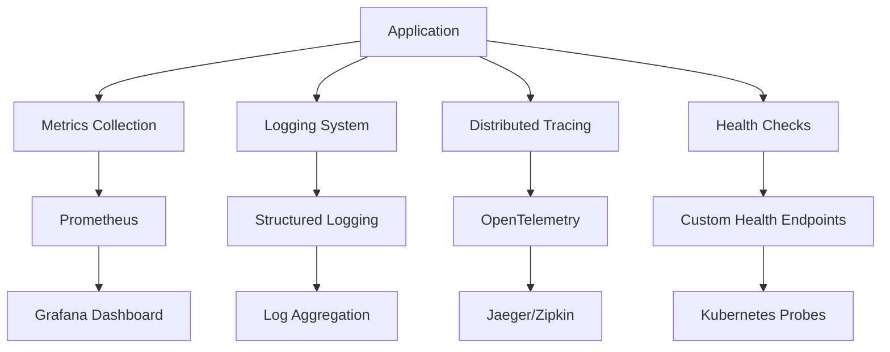

# 🔍 Observability & Monitoring Guide

This document outlines the comprehensive observability stack for the Chest X-Ray Pneumonia Detector project, designed for production-grade monitoring and debugging.

## 🏗️ Architecture Overview



## 📊 Metrics Collection

### Application Metrics
- **Request/Response**: Latency, throughput, error rates
- **Model Performance**: Inference time, accuracy, confidence scores
- **Resource Usage**: CPU, memory, GPU utilization
- **Business Metrics**: Predictions per hour, model accuracy trends

### Infrastructure Metrics
- **Container Health**: Memory, CPU, disk usage
- **Network Performance**: Bandwidth, connection pools
- **Storage I/O**: Read/write latency, throughput
- **GPU Metrics**: Utilization, memory, temperature

### Custom Metrics Implementation

```python
# Example: Custom metrics in src/monitoring/metrics.py
from prometheus_client import Counter, Histogram, Gauge

# Request metrics
REQUEST_COUNT = Counter('http_requests_total', 'Total HTTP requests', ['method', 'endpoint'])
REQUEST_LATENCY = Histogram('http_request_duration_seconds', 'HTTP request latency')

# Model metrics
PREDICTION_COUNT = Counter('ml_predictions_total', 'Total ML predictions', ['model_version'])
INFERENCE_TIME = Histogram('ml_inference_duration_seconds', 'ML inference duration')
MODEL_ACCURACY = Gauge('ml_model_accuracy', 'Current model accuracy score')
```

## 📝 Structured Logging

### Log Levels and Categories
- **ERROR**: System failures, exceptions, critical issues
- **WARN**: Performance degradation, fallback actions
- **INFO**: Business events, successful operations
- **DEBUG**: Detailed execution flow (development only)

### Log Format Structure
```json
{
  "timestamp": "2024-07-30T10:30:00Z",
  "level": "INFO",
  "service": "pneumonia-detector",
  "version": "1.2.0",
  "trace_id": "abc123",
  "span_id": "def456",
  "message": "Model inference completed",
  "context": {
    "model_version": "v2.1",
    "image_id": "chest_xray_001.jpg",
    "prediction": "pneumonia",
    "confidence": 0.95,
    "inference_time_ms": 120
  }
}
```

### Correlation IDs
Every request includes a unique correlation ID for tracking across services:
- Generated at API gateway/entry point
- Propagated through all downstream services
- Included in all log entries and metrics
- Used for distributed tracing correlation

## 🔍 Distributed Tracing

### OpenTelemetry Integration
```python
# Example: Tracing implementation
from opentelemetry import trace
from opentelemetry.exporter.jaeger.thrift import JaegerExporter
from opentelemetry.sdk.trace import TracerProvider
from opentelemetry.sdk.trace.export import BatchSpanProcessor

# Configure tracing
tracer = trace.get_tracer(__name__)

@tracer.start_as_current_span("model_inference")
def predict(image_data):
    span = trace.get_current_span()
    span.set_attribute("image.size", len(image_data))
    span.set_attribute("model.version", "v2.1")
    
    # Perform inference
    result = model.predict(image_data)
    
    span.set_attribute("prediction.result", result)
    span.set_attribute("prediction.confidence", confidence)
    return result
```

### Trace Collection Points
- **API Requests**: Complete request lifecycle
- **Model Inference**: Training and prediction operations
- **Data Processing**: Image preprocessing, augmentation
- **Database Operations**: Model storage, metadata queries
- **External Services**: Cloud storage, notification services

## 🏥 Health Checks

### Health Check Types

#### Liveness Probe
```python
# Basic service health
@app.route('/health/live')
def liveness():
    return {"status": "alive", "timestamp": datetime.utcnow()}
```

#### Readiness Probe
```python
# Service readiness for traffic
@app.route('/health/ready')
def readiness():
    checks = {
        "model_loaded": check_model_loaded(),
        "database_connected": check_database(),
        "storage_accessible": check_storage()
    }
    
    if all(checks.values()):
        return {"status": "ready", "checks": checks}
    else:
        return {"status": "not_ready", "checks": checks}, 503
```

#### Startup Probe
```python
# Service initialization completion
@app.route('/health/startup')
def startup():
    return {
        "status": "started" if app_initialized else "starting",
        "startup_time": startup_duration,
        "components": startup_components_status()
    }
```

### Deep Health Checks
- **Model Validation**: Test inference with sample data
- **Memory Health**: Check for memory leaks, garbage collection
- **GPU Status**: CUDA availability, memory usage
- **Data Pipeline**: End-to-end data flow validation

## 📈 Alerting Strategy

### Alert Severity Levels
- **Critical**: Service down, data loss, security breach
- **High**: Performance degradation, high error rates
- **Medium**: Resource constraints, configuration issues
- **Low**: Informational, maintenance notifications

### Alert Rules Examples

#### Error Rate Alert
```yaml
groups:
  - name: application.rules
    rules:
      - alert: HighErrorRate
        expr: rate(http_requests_total{status=~"5.."}[5m]) > 0.1
        for: 2m
        labels:
          severity: critical
        annotations:
          summary: "High error rate detected"
          description: "Error rate is {{ $value }} errors per second"
```

#### Model Performance Alert
```yaml
      - alert: ModelAccuracyDrop
        expr: ml_model_accuracy < 0.85
        for: 5m
        labels:
          severity: high
        annotations:
          summary: "Model accuracy below threshold"
          description: "Current accuracy: {{ $value }}"
```

#### Resource Usage Alert
```yaml
      - alert: HighMemoryUsage
        expr: container_memory_usage_bytes / container_spec_memory_limit_bytes > 0.9
        for: 3m
        labels:
          severity: medium
        annotations:
          summary: "Container memory usage high"
          description: "Memory usage at {{ $value }}%"
```

## 🎯 Performance Monitoring

### Key Performance Indicators (KPIs)
- **Throughput**: Requests per second, predictions per minute
- **Latency**: P50, P95, P99 response times
- **Availability**: Uptime percentage, error rates
- **Resource Efficiency**: CPU/memory/GPU utilization
- **Model Quality**: Accuracy, precision, recall over time

### SLA/SLO Definitions
```yaml
slos:
  availability:
    target: 99.9%
    measurement: uptime
  latency:
    target: 500ms
    percentile: 95
    measurement: response_time
  error_rate:
    target: 0.1%
    measurement: error_ratio
```

## 🔧 Dashboard Configuration

### Grafana Dashboard Panels
1. **Service Overview**: Status, uptime, request volume
2. **Performance Metrics**: Latency, throughput, error rates
3. **Model Metrics**: Accuracy trends, inference times, confidence distributions
4. **Infrastructure**: CPU, memory, GPU, network usage
5. **Alerts**: Active alerts, alert history, resolution times

### Custom Dashboard JSON
```json
{
  "dashboard": {
    "title": "Pneumonia Detector - Production Overview",
    "panels": [
      {
        "title": "Request Rate",
        "targets": [
          {
            "expr": "rate(http_requests_total[5m])",
            "legendFormat": "{{ method }} {{ endpoint }}"
          }
        ]
      }
    ]
  }
}
```

## 🚀 Deployment Monitoring

### CI/CD Pipeline Observability
- **Build Metrics**: Build time, success rate, test coverage
- **Deployment Tracking**: Deployment frequency, lead time, failure rate
- **Rollback Monitoring**: Rollback triggers, recovery time

### Canary Deployment Monitoring
```python
# Canary metrics comparison
def compare_canary_metrics(canary_metrics, production_metrics):
    error_rate_diff = canary_metrics.error_rate - production_metrics.error_rate
    latency_diff = canary_metrics.p95_latency - production_metrics.p95_latency
    
    if error_rate_diff > 0.05 or latency_diff > 100:
        trigger_rollback("Performance degradation detected")
```

## 🔐 Security Monitoring

### Security Metrics
- **Authentication Failures**: Failed login attempts, token violations
- **Authorization Issues**: Access denied events, privilege escalation
- **Input Validation**: Malformed requests, injection attempts
- **Compliance**: GDPR, HIPAA violation patterns

### Audit Logging
```python
# Security audit logging
def log_security_event(event_type, user_id, resource, action, result):
    security_logger.info({
        "event_type": "security_audit",
        "timestamp": datetime.utcnow(),
        "user_id": user_id,
        "resource": resource,
        "action": action,
        "result": result,
        "ip_address": request.remote_addr,
        "user_agent": request.user_agent.string
    })
```

## 📱 Alerting Channels

### Notification Methods
- **Slack**: Real-time alerts to development channels
- **Email**: Detailed alert summaries for stakeholders
- **PagerDuty**: Critical alerts for on-call engineers
- **Webhooks**: Integration with external incident management

### Alert Routing
```yaml
route:
  group_by: ['alertname', 'cluster', 'service']
  group_wait: 10s
  group_interval: 10s
  repeat_interval: 1h
  receiver: 'default'
  routes:
    - match:
        severity: critical
      receiver: 'pagerduty'
    - match:
        severity: high
      receiver: 'slack-alerts'
```

## 🔄 Continuous Improvement

### Monitoring Evolution
1. **Baseline Establishment**: Initial metrics collection and thresholds
2. **Pattern Recognition**: Identify recurring issues and trends
3. **Proactive Alerting**: Predictive alerts based on historical data
4. **Automated Response**: Self-healing systems and automated remediation

### Regular Review Process
- **Weekly**: Dashboard review, alert fatigue assessment
- **Monthly**: SLO review, threshold adjustment
- **Quarterly**: Observability strategy evaluation, tool assessment
- **Annually**: Complete monitoring stack review and modernization

## 📚 Tools and Technologies

### Monitoring Stack
- **Metrics**: Prometheus, Grafana, AlertManager
- **Logging**: Fluentd, Elasticsearch, Kibana (ELK Stack)
- **Tracing**: Jaeger, Zipkin, OpenTelemetry
- **APM**: New Relic, DataDog, Elastic APM

### Development Tools
- **Local Monitoring**: Docker Compose with monitoring services
- **Testing**: Synthetic monitoring, chaos engineering
- **Debugging**: Remote debugging, memory profilers

---

This observability framework ensures comprehensive visibility into the system's behavior, enabling proactive issue detection and rapid incident response while maintaining high service quality and user satisfaction.