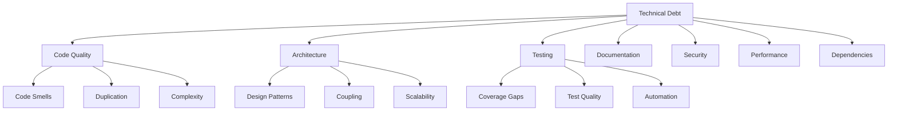

# 🔧 Technical Debt Management Strategy

This document provides a comprehensive framework for identifying, measuring, prioritizing, and systematically reducing technical debt in the Chest X-Ray Pneumonia Detector project.

## 📊 Technical Debt Assessment Matrix

### Debt Categories and Impact



### Technical Debt Inventory

#### 1. Code Quality Debt
- **Cyclomatic Complexity**: Functions exceeding complexity threshold (>10)
- **Code Duplication**: Identical or similar code blocks across modules
- **Code Smells**: Long parameter lists, large classes, feature envy
- **Magic Numbers**: Hardcoded values without named constants
- **Inconsistent Naming**: Non-standard variable/function naming

#### 2. Architecture Debt
- **Tight Coupling**: High interdependence between modules
- **Monolithic Structure**: Components that should be separated
- **Missing Abstractions**: Repeated patterns without proper abstraction
- **Anti-patterns**: God objects, spaghetti code, circular dependencies
- **Scalability Bottlenecks**: Architecture limiting horizontal scaling

#### 3. Testing Debt
- **Coverage Gaps**: Untested or inadequately tested code paths
- **Brittle Tests**: Tests that fail due to minor changes
- **Missing Test Types**: Lack of integration, performance, or security tests
- **Test Data Management**: Hardcoded test data, poor test isolation
- **Flaky Tests**: Non-deterministic test failures

#### 4. Documentation Debt
- **Outdated Documentation**: Documentation not reflecting current implementation
- **Missing API Documentation**: Undocumented interfaces and functions
- **Architectural Documentation**: Missing or incomplete system design docs
- **Runbooks**: Incomplete operational procedures
- **Code Comments**: Missing or misleading inline documentation

#### 5. Security Debt
- **Dependency Vulnerabilities**: Outdated libraries with known security issues
- **Authentication Gaps**: Weak or missing authentication mechanisms
- **Input Validation**: Insufficient validation of user inputs
- **Data Encryption**: Unencrypted sensitive data storage or transmission
- **Access Controls**: Overly permissive or missing access restrictions

#### 6. Performance Debt
- **Inefficient Algorithms**: Suboptimal algorithm choices affecting performance
- **Memory Leaks**: Unreleased memory allocation causing degradation
- **Database Queries**: N+1 queries, missing indexes, inefficient joins
- **Caching Strategy**: Missing or ineffective caching implementation
- **Resource Management**: Poor handling of file handles, connections

#### 7. Dependency Debt
- **Outdated Dependencies**: Libraries behind current stable versions
- **Dependency Conflicts**: Version conflicts between libraries
- **Unused Dependencies**: Dead dependencies increasing bundle size
- **Security Vulnerabilities**: Dependencies with known security issues
- **License Compatibility**: Conflicting or restrictive licenses

## 📏 Technical Debt Measurement

### Automated Debt Detection Tools

```python
# technical_debt_analyzer.py
class TechnicalDebtAnalyzer:
    def __init__(self, project_path):
        self.project_path = project_path
        self.debt_metrics = {}
    
    def analyze_code_quality(self):
        """Analyze code quality metrics using multiple tools"""
        tools = {
            'radon': self.run_radon_analysis(),
            'pylint': self.run_pylint_analysis(),
            'mypy': self.run_mypy_analysis(),
            'bandit': self.run_bandit_analysis()
        }
        
        return self.aggregate_quality_metrics(tools)
    
    def run_radon_analysis(self):
        """Cyclomatic complexity and maintainability analysis"""
        import subprocess
        import json
        
        # Cyclomatic complexity
        cc_result = subprocess.run([
            'radon', 'cc', self.project_path, '--json'
        ], capture_output=True, text=True)
        
        # Maintainability index
        mi_result = subprocess.run([
            'radon', 'mi', self.project_path, '--json'
        ], capture_output=True, text=True)
        
        return {
            'cyclomatic_complexity': json.loads(cc_result.stdout),
            'maintainability_index': json.loads(mi_result.stdout)
        }
    
    def calculate_debt_score(self, metrics):
        """Calculate overall technical debt score"""
        weights = {
            'code_quality': 0.25,
            'test_coverage': 0.20,
            'security_issues': 0.20,
            'performance_issues': 0.15,
            'documentation_coverage': 0.10,
            'dependency_health': 0.10
        }
        
        debt_score = 0
        for category, weight in weights.items():
            category_score = metrics.get(category, 0)
            debt_score += category_score * weight
        
        return {
            'overall_score': debt_score,
            'category_breakdown': metrics,
            'debt_level': self.categorize_debt_level(debt_score)
        }
    
    def categorize_debt_level(self, score):
        """Categorize debt level based on score"""
        if score >= 80:
            return 'LOW'
        elif score >= 60:
            return 'MODERATE'
        elif score >= 40:
            return 'HIGH'
        else:
            return 'CRITICAL'
```

### SonarQube Integration

```yaml
# sonar-project.properties
sonar.projectKey=chest-xray-pneumonia-detector
sonar.projectName=Chest X-Ray Pneumonia Detector
sonar.projectVersion=1.0

# Source configuration
sonar.sources=src
sonar.tests=tests
sonar.python.coverage.reportPaths=coverage.xml

# Quality gate configuration
sonar.qualitygate.wait=true

# Technical debt settings
sonar.technicalDebt.hoursInDay=8
sonar.technicalDebt.ratingGrid=0.1,0.2,0.5,1
sonar.technicalDebt.developmentCost=30

# Coverage thresholds
sonar.coverage.exclusions=**/tests/**,**/__init__.py
sonar.python.xunit.reportPath=pytest.xml

# Duplication detection
sonar.cpd.exclusions=**/tests/**
sonar.python.duplicatedBlocks.threshold=10
```

### Custom Debt Metrics Dashboard

```python
# debt_dashboard.py
class TechnicalDebtDashboard:
    def __init__(self, debt_analyzer):
        self.debt_analyzer = debt_analyzer
        self.historical_data = self.load_historical_metrics()
    
    def generate_debt_report(self):
        """Generate comprehensive technical debt report"""
        current_metrics = self.debt_analyzer.analyze_project()
        
        report = {
            'timestamp': datetime.utcnow().isoformat(),
            'overall_health': self.calculate_overall_health(current_metrics),
            'debt_trends': self.analyze_debt_trends(),
            'priority_items': self.identify_priority_debt_items(),
            'recommendations': self.generate_recommendations(),
            'progress_tracking': self.track_debt_reduction_progress()
        }
        
        return report
    
    def analyze_debt_trends(self):
        """Analyze technical debt trends over time"""
        trend_analysis = {}
        
        for category in ['code_quality', 'test_coverage', 'security', 'performance']:
            historical_values = [
                entry[category] for entry in self.historical_data
            ]
            
            trend_analysis[category] = {
                'current_value': historical_values[-1] if historical_values else 0,
                'trend_direction': self.calculate_trend_direction(historical_values),
                'monthly_change': self.calculate_monthly_change(historical_values),
                'improvement_rate': self.calculate_improvement_rate(historical_values)
            }
        
        return trend_analysis
    
    def identify_priority_debt_items(self):
        """Identify high-priority technical debt items"""
        debt_items = self.debt_analyzer.get_detailed_debt_items()
        
        # Prioritization factors
        for item in debt_items:
            item['priority_score'] = self.calculate_priority_score(
                impact=item['impact'],
                effort=item['effort'],
                risk=item['risk'],
                frequency=item['frequency']
            )
        
        # Sort by priority score (descending)
        priority_items = sorted(
            debt_items, 
            key=lambda x: x['priority_score'], 
            reverse=True
        )
        
        return priority_items[:20]  # Top 20 priority items
```

## 🎯 Debt Prioritization Framework

### Priority Matrix

```python
# debt_prioritization.py
class DebtPrioritization:
    def __init__(self):
        self.priority_matrix = {
            'impact': {
                'critical': 5,    # System failure, security breach
                'high': 4,        # Performance degradation, user experience
                'medium': 3,      # Maintainability issues
                'low': 2,         # Minor code quality issues
                'minimal': 1      # Cosmetic improvements
            },
            'effort': {
                'trivial': 1,     # < 1 day
                'minor': 2,       # 1-3 days
                'moderate': 3,    # 1 week
                'major': 4,       # 2-4 weeks
                'massive': 5      # > 1 month
            },
            'risk': {
                'very_high': 5,   # High probability of failure
                'high': 4,        # Likely to cause issues
                'medium': 3,      # Some risk involved
                'low': 2,         # Minimal risk
                'very_low': 1     # Safe change
            }
        }
    
    def calculate_priority_score(self, impact, effort, risk, frequency=1):
        """Calculate priority score using weighted factors"""
        impact_score = self.priority_matrix['impact'][impact]
        effort_score = self.priority_matrix['effort'][effort]
        risk_score = self.priority_matrix['risk'][risk]
        
        # Formula: (Impact * Risk * Frequency) / Effort
        priority_score = (impact_score * risk_score * frequency) / effort_score
        
        return round(priority_score, 2)
    
    def categorize_priority(self, score):
        """Categorize priority based on calculated score"""
        if score >= 15:
            return 'CRITICAL'
        elif score >= 10:
            return 'HIGH'
        elif score >= 5:
            return 'MEDIUM'
        else:
            return 'LOW'
```

### Debt Reduction Strategy

```python
# debt_reduction_strategy.py
class DebtReductionStrategy:
    def __init__(self, debt_inventory, team_capacity):
        self.debt_inventory = debt_inventory
        self.team_capacity = team_capacity
        self.strategy_types = {
            'strangler_fig': self.strangler_fig_approach,
            'big_bang': self.big_bang_approach,
            'incremental': self.incremental_approach,
            'opportunistic': self.opportunistic_approach
        }
    
    def create_reduction_plan(self, time_horizon='quarter'):
        """Create comprehensive debt reduction plan"""
        prioritized_items = self.prioritize_debt_items()
        
        plan = {
            'immediate_actions': self.plan_immediate_actions(prioritized_items),
            'sprint_integration': self.plan_sprint_integration(prioritized_items),
            'refactoring_sprints': self.plan_refactoring_sprints(prioritized_items),
            'long_term_strategy': self.plan_long_term_strategy(prioritized_items),
            'success_metrics': self.define_success_metrics(),
            'risk_mitigation': self.identify_reduction_risks()
        }
        
        return plan
    
    def strangler_fig_approach(self, legacy_component):
        """Gradually replace legacy components with new implementation"""
        phases = [
            {
                'phase': 'wrapper_creation',
                'description': 'Create abstraction layer around legacy component',
                'duration': '1 sprint',
                'risk': 'low'
            },
            {
                'phase': 'incremental_replacement',
                'description': 'Replace functionality piece by piece',
                'duration': '3-6 sprints',
                'risk': 'medium'
            },
            {
                'phase': 'legacy_removal',
                'description': 'Remove original legacy component',
                'duration': '1 sprint',
                'risk': 'low'
            }
        ]
        
        return phases
    
    def plan_sprint_integration(self, debt_items):
        """Integrate debt reduction into regular sprint planning"""
        sprint_plan = {}
        
        # Allocate 20% of sprint capacity to technical debt
        debt_capacity = self.team_capacity * 0.20
        
        for sprint_num in range(1, 7):  # 6 sprints ahead
            sprint_debt_items = []
            remaining_capacity = debt_capacity
            
            for item in debt_items:
                if item['effort'] <= remaining_capacity:
                    sprint_debt_items.append(item)
                    remaining_capacity -= item['effort']
                    debt_items.remove(item)
                
                if remaining_capacity <= 0:
                    break
            
            sprint_plan[f'sprint_{sprint_num}'] = {
                'debt_items': sprint_debt_items,
                'allocated_capacity': debt_capacity - remaining_capacity,
                'expected_improvement': self.calculate_expected_improvement(sprint_debt_items)
            }
        
        return sprint_plan
```

## 📈 Continuous Debt Monitoring

### Automated Debt Tracking

```python
# debt_monitor.py
class TechnicalDebtMonitor:
    def __init__(self, monitoring_config):
        self.config = monitoring_config
        self.debt_thresholds = self.config['debt_thresholds']
        self.alert_system = AlertSystem()
    
    async def continuous_monitoring(self):
        """Continuous monitoring of technical debt metrics"""
        while True:
            current_metrics = await self.collect_current_metrics()
            
            # Check for threshold violations
            violations = self.check_threshold_violations(current_metrics)
            
            if violations:
                await self.handle_threshold_violations(violations)
            
            # Update historical data
            self.update_historical_metrics(current_metrics)
            
            # Generate periodic reports
            if self.should_generate_report():
                report = self.generate_periodic_report()
                await self.distribute_report(report)
            
            await asyncio.sleep(self.config['check_interval'])
    
    def check_threshold_violations(self, metrics):
        """Check if current metrics violate defined thresholds"""
        violations = []
        
        for metric_name, threshold in self.debt_thresholds.items():
            current_value = metrics.get(metric_name, 0)
            
            if self.is_threshold_violated(current_value, threshold):
                violations.append({
                    'metric': metric_name,
                    'current_value': current_value,
                    'threshold': threshold,
                    'severity': self.calculate_violation_severity(current_value, threshold)
                })
        
        return violations
    
    async def handle_threshold_violations(self, violations):
        """Handle technical debt threshold violations"""
        for violation in violations:
            if violation['severity'] == 'critical':
                # Immediate action required
                await self.trigger_immediate_response(violation)
            elif violation['severity'] == 'high':
                # Schedule debt reduction task
                await self.schedule_debt_reduction_task(violation)
            else:
                # Log for future planning
                self.log_debt_concern(violation)
```

### Debt Metrics Integration with CI/CD

```yaml
# .github/workflows/debt-monitoring.yml
name: Technical Debt Monitoring

on:
  push:
    branches: [main, develop]
  pull_request:
  schedule:
    - cron: '0 2 * * 1'  # Weekly on Monday at 2 AM

jobs:
  debt-analysis:
    runs-on: ubuntu-latest
    steps:
      - uses: actions/checkout@v3
        with:
          fetch-depth: 0  # Full history for trend analysis
      
      - name: Setup Python
        uses: actions/setup-python@v4
        with:
          python-version: '3.10'
      
      - name: Install dependencies
        run: |
          pip install -r requirements-dev.txt
          pip install radon pylint mypy bandit safety
      
      - name: Run technical debt analysis
        run: |
          python scripts/analyze_technical_debt.py --output debt-report.json
      
      - name: Check debt thresholds
        run: |
          python scripts/check_debt_thresholds.py debt-report.json
      
      - name: Generate debt trend report
        if: github.ref == 'refs/heads/main'
        run: |
          python scripts/generate_debt_trends.py
      
      - name: Upload debt report
        uses: actions/upload-artifact@v3
        with:
          name: technical-debt-report
          path: debt-report.json
      
      - name: Comment on PR
        if: github.event_name == 'pull_request'
        uses: actions/github-script@v6
        with:
          script: |
            const fs = require('fs');
            const report = JSON.parse(fs.readFileSync('debt-report.json', 'utf8'));
            const comment = `## Technical Debt Analysis
            
            **Overall Debt Score:** ${report.overall_score}/100
            **Debt Level:** ${report.debt_level}
            
            **Key Issues:**
            ${report.priority_items.slice(0, 5).map(item => 
              `- ${item.description} (Priority: ${item.priority})`
            ).join('\n')}
            
            [View Full Report](${report.report_url})`;
            
            github.rest.issues.createComment({
              issue_number: context.issue.number,
              owner: context.repo.owner,
              repo: context.repo.repo,
              body: comment
            });
```

## 🔄 Debt Reduction Implementation

### Refactoring Sprint Planning

```python
# refactoring_sprint.py
class RefactoringSprint:
    def __init__(self, debt_items, team_capacity):
        self.debt_items = debt_items
        self.team_capacity = team_capacity
        self.sprint_duration = 10  # days
    
    def plan_refactoring_sprint(self):
        """Plan dedicated refactoring sprint"""
        sprint_plan = {
            'objectives': self.define_sprint_objectives(),
            'selected_items': self.select_debt_items(),
            'approach_strategies': self.define_refactoring_strategies(),
            'risk_mitigation': self.plan_risk_mitigation(),
            'success_criteria': self.define_success_criteria(),
            'rollback_plan': self.create_rollback_plan()
        }
        
        return sprint_plan
    
    def select_debt_items(self):
        """Select debt items for refactoring sprint"""
        # Focus on high-impact, related items
        selected_items = []
        remaining_capacity = self.team_capacity
        
        # Group related items
        item_groups = self.group_related_items(self.debt_items)
        
        for group in sorted(item_groups, key=lambda g: g['total_impact'], reverse=True):
            if group['total_effort'] <= remaining_capacity:
                selected_items.extend(group['items'])
                remaining_capacity -= group['total_effort']
        
        return selected_items
    
    def define_refactoring_strategies(self):
        """Define specific refactoring strategies for selected items"""
        strategies = {}
        
        for item in self.selected_items:
            if item['category'] == 'code_complexity':
                strategies[item['id']] = self.extract_method_strategy(item)
            elif item['category'] == 'duplication':
                strategies[item['id']] = self.extract_common_code_strategy(item)
            elif item['category'] == 'architecture':
                strategies[item['id']] = self.refactor_architecture_strategy(item)
        
        return strategies
```

### Boy Scout Rule Implementation

```python
# boy_scout_rule.py
class BoyScoutRule:
    """Implementation of 'Always leave the code better than you found it'"""
    
    def __init__(self):
        self.improvement_types = [
            'rename_variables',
            'extract_methods',
            'add_documentation',
            'improve_error_handling',
            'add_type_hints',
            'simplify_conditionals'
        ]
    
    def analyze_code_changes(self, changed_files):
        """Analyze code changes for improvement opportunities"""
        opportunities = []
        
        for file_path in changed_files:
            file_analysis = self.analyze_file(file_path)
            
            # Identify small improvements that can be made
            for improvement in self.identify_small_improvements(file_analysis):
                if self.is_safe_improvement(improvement):
                    opportunities.append({
                        'file': file_path,
                        'improvement': improvement,
                        'effort': self.estimate_effort(improvement),
                        'impact': self.estimate_impact(improvement)
                    })
        
        return self.prioritize_opportunities(opportunities)
    
    def suggest_improvements(self, pr_context):
        """Suggest Boy Scout improvements for PR"""
        opportunities = self.analyze_code_changes(pr_context['changed_files'])
        
        suggestions = []
        for opportunity in opportunities[:3]:  # Top 3 suggestions
            suggestions.append({
                'description': self.generate_improvement_description(opportunity),
                'code_example': self.generate_code_example(opportunity),
                'rationale': self.explain_improvement_rationale(opportunity)
            })
        
        return suggestions
```

## 📊 Debt Visualization and Reporting

### Interactive Debt Dashboard

```python
# debt_visualization.py
import plotly.graph_objects as go
from plotly.subplots import make_subplots

class DebtVisualization:
    def __init__(self, debt_data):
        self.debt_data = debt_data
    
    def create_debt_overview_dashboard(self):
        """Create comprehensive debt overview dashboard"""
        fig = make_subplots(
            rows=2, cols=2,
            subplot_titles=('Debt Distribution', 'Trend Analysis', 
                          'Priority Matrix', 'Progress Tracking'),
            specs=[[{'type': 'pie'}, {'type': 'scatter'}],
                   [{'type': 'scatter'}, {'type': 'bar'}]]
        )
        
        # Debt distribution pie chart
        fig.add_trace(
            go.Pie(
                labels=list(self.debt_data['categories'].keys()),
                values=list(self.debt_data['categories'].values()),
                name="Debt Distribution"
            ),
            row=1, col=1
        )
        
        # Trend analysis
        fig.add_trace(
            go.Scatter(
                x=self.debt_data['trends']['dates'],
                y=self.debt_data['trends']['overall_scores'],
                mode='lines+markers',
                name='Overall Debt Score'
            ),
            row=1, col=2
        )
        
        # Priority matrix
        fig.add_trace(
            go.Scatter(
                x=[item['impact'] for item in self.debt_data['items']],
                y=[item['effort'] for item in self.debt_data['items']],
                mode='markers',
                marker=dict(
                    size=[item['priority'] * 5 for item in self.debt_data['items']],
                    color=[item['risk'] for item in self.debt_data['items']],
                    colorscale='Viridis'
                ),
                text=[item['description'] for item in self.debt_data['items']],
                name='Priority Matrix'
            ),
            row=2, col=1
        )
        
        # Progress tracking
        fig.add_trace(
            go.Bar(
                x=list(self.debt_data['progress'].keys()),
                y=list(self.debt_data['progress'].values()),
                name='Debt Reduction Progress'
            ),
            row=2, col=2
        )
        
        fig.update_layout(
            title_text="Technical Debt Dashboard",
            showlegend=True,
            height=800
        )
        
        return fig
    
    def generate_debt_heatmap(self):
        """Generate technical debt heatmap by module/component"""
        import seaborn as sns
        import matplotlib.pyplot as plt
        
        # Create matrix of debt scores by component and category
        debt_matrix = self.create_debt_matrix()
        
        plt.figure(figsize=(12, 8))
        heatmap = sns.heatmap(
            debt_matrix,
            annot=True,
            cmap='RdYlGn_r',
            center=50,
            square=True,
            fmt='.1f'
        )
        
        plt.title('Technical Debt Heatmap by Component')
        plt.xlabel('Debt Categories')
        plt.ylabel('Components')
        
        return heatmap
```

### Automated Reporting

```python
# debt_reporting.py
class DebtReporting:
    def __init__(self, debt_analyzer, notification_system):
        self.debt_analyzer = debt_analyzer
        self.notification_system = notification_system
    
    def generate_weekly_report(self):
        """Generate weekly technical debt report"""
        current_metrics = self.debt_analyzer.analyze_project()
        historical_comparison = self.compare_with_previous_week()
        
        report = {
            'report_date': datetime.utcnow().isoformat(),
            'executive_summary': self.create_executive_summary(current_metrics),
            'key_metrics': current_metrics,
            'trend_analysis': historical_comparison,
            'action_items': self.identify_action_items(),
            'recommendations': self.generate_recommendations(),
            'next_week_plan': self.plan_next_week_activities()
        }
        
        # Generate different formats
        html_report = self.format_as_html(report)
        pdf_report = self.format_as_pdf(report)
        json_report = self.format_as_json(report)
        
        return {
            'html': html_report,
            'pdf': pdf_report,
            'json': json_report
        }
    
    async def distribute_reports(self, reports):
        """Distribute reports to stakeholders"""
        stakeholder_preferences = {
            'development_team': ['html', 'json'],
            'tech_leads': ['pdf', 'html'],
            'management': ['pdf'],
            'product_owners': ['html']
        }
        
        for stakeholder, formats in stakeholder_preferences.items():
            for format_type in formats:
                await self.notification_system.send_report(
                    stakeholder,
                    reports[format_type],
                    format_type
                )
```

## 🎯 Success Metrics and KPIs

### Technical Debt KPIs

```python
# debt_kpis.py
class TechnicalDebtKPIs:
    def __init__(self):
        self.kpis = {
            'debt_ratio': self.calculate_debt_ratio,
            'debt_velocity': self.calculate_debt_velocity,
            'debt_paydown_rate': self.calculate_paydown_rate,
            'code_quality_index': self.calculate_quality_index,
            'maintainability_score': self.calculate_maintainability_score,
            'refactoring_roi': self.calculate_refactoring_roi
        }
    
    def calculate_debt_ratio(self, metrics):
        """Calculate the ratio of technical debt to total codebase"""
        total_lines = metrics['total_lines_of_code']
        debt_lines = metrics['problematic_lines_of_code']
        
        return (debt_lines / total_lines) * 100 if total_lines > 0 else 0
    
    def calculate_debt_velocity(self, historical_metrics):
        """Calculate the rate at which technical debt is being introduced"""
        if len(historical_metrics) < 2:
            return 0
        
        current_debt = historical_metrics[-1]['total_debt_hours']
        previous_debt = historical_metrics[-2]['total_debt_hours']
        time_diff = (
            datetime.fromisoformat(historical_metrics[-1]['timestamp']) -
            datetime.fromisoformat(historical_metrics[-2]['timestamp'])
        ).days
        
        return (current_debt - previous_debt) / time_diff if time_diff > 0 else 0
    
    def calculate_refactoring_roi(self, refactoring_efforts):
        """Calculate ROI of refactoring efforts"""
        total_investment = sum(effort['hours_spent'] for effort in refactoring_efforts)
        total_savings = sum(effort['estimated_savings'] for effort in refactoring_efforts)
        
        roi = (total_savings - total_investment) / total_investment if total_investment > 0 else 0
        return roi * 100  # Return as percentage
    
    def generate_kpi_dashboard(self, current_metrics, historical_data):
        """Generate KPI dashboard with trends"""
        dashboard = {}
        
        for kpi_name, kpi_function in self.kpis.items():
            current_value = kpi_function(current_metrics)
            historical_values = [
                kpi_function(metrics) for metrics in historical_data
            ]
            
            dashboard[kpi_name] = {
                'current_value': current_value,
                'trend': self.calculate_trend(historical_values),
                'target': self.get_kpi_target(kpi_name),
                'status': self.evaluate_kpi_status(current_value, kpi_name)
            }
        
        return dashboard
```

---

This comprehensive technical debt management strategy provides the framework and tools necessary to systematically identify, prioritize, and reduce technical debt while maintaining development velocity and code quality. Regular application of these practices ensures long-term codebase health and maintainability.